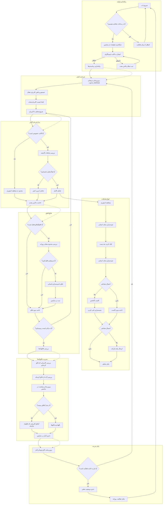

```mermaid
flowchart TD
    subgraph "راه‌اندازی اولیه"
        A[شروع بات] --> B{آیا در ساعات فعالیت هستیم؟}
        B -->|بله| C[بارگذاری تنظیمات از دیتابیس]
        B -->|خیر| Z[انتظار تا زمان فعالیت]
        Z --> A
        C --> D[اتصال به اکانت اینستاگرام]
        D -->|موفق| E[راه‌اندازی زمانبندی‌ها]
        D -->|ناموفق| D1[ثبت خطا و تلاش مجدد]
        D1 --> D
    end

    subgraph "چرخه‌ی اصلی"
        E --> F[بروزرسانی ترندها و هشتگ‌های محبوب]
        F --> G[جستجو و یافتن کاربران فعال]
        G --> H[ایجاد لیست کاربران هدف]
        H --> I[شروع تعامل با کاربران]
    end

    subgraph "پردازش هر کاربر"
        I --> J{آیا اکانت خصوصی است؟}
        J -->|بله| K[محدود به مشاهده استوری]
        J -->|خیر| L[بررسی تعاملات گذشته]
        L --> M{آیا قبلاً تعامل داشته‌ایم؟}
        M -->|بله| N[تعامل با وزن کمتر]
        M -->|خیر| O[تعامل کامل]
        K --> P[ادامه به کاربر بعدی]
        N --> P
        O --> P
    end

    subgraph "انواع تعاملات"
        O --> O1[مشاهده استوری]
        O1 --> O2[شبیه‌سازی مکث انسانی]
        O2 --> O3[لایک کردن چند پست]
        O3 --> O4[شبیه‌سازی مکث انسانی]
        O4 --> O5{احتمال تصادفی}
        O5 -->|بالا| O6[کامنت گذاشتن]
        O5 -->|پایین| O7[ادامه بدون کامنت]
        O6 --> O8[شبیه‌سازی تایپ کردن]
        O8 --> O9{احتمال تصادفی}
        O7 --> O9
        O9 -->|پایین| O10[پایان تعامل]
        O9 -->|بالا| O11[ارسال پیام دایرکت]
        O11 --> O10
    end

    subgraph "فالو/آنفالو"
        P --> Q{آیا فالو/آنفالو فعال است؟}
        Q -->|بله| R[بررسی محدودیت‌های روزانه]
        Q -->|خیر| S[ادامه بدون فالو]
        R --> T{آیا می‌توانیم فالو کنیم؟}
        T -->|بله| U[فالو با شبیه‌سازی انسانی]
        T -->|خیر| S
        U --> V[ثبت در دیتابیس]
        V --> S
        S --> W{آیا به پایان لیست رسیده‌ایم؟}
        W -->|بله| X[بررسی فالوبک‌ها]
        W -->|خیر| I
    end

    subgraph "مدیریت فالوبک‌ها"
        X --> X1[بررسی کاربرانی که فالو کرده‌ایم]
        X1 --> X2[بررسی آیا ما را فالو کرده‌اند]
        X2 --> X3[بروزرسانی وضعیت در دیتابیس]
        X3 --> X4{آیا زمان آنفالو رسیده؟}
        X4 -->|بله| X5[آنفالو کاربرانی که فالوبک نداده‌اند]
        X4 -->|خیر| X6[نگهداری فالوها]
        X5 --> Y[ذخیره آمار در دیتابیس]
        X6 --> Y
    end

    subgraph "پایان چرخه"
        Y --> Y1[بروزرسانی گزارش‌ها و آمار]
        Y1 --> Y2{آیا نیاز به ادامه فعالیت است؟}
        Y2 -->|بله| F
        Y2 -->|خیر| Y3[ذخیره وضعیت فعلی]
        Y3 --> Y4[پایان فعالیت روزانه]
        Y4 --> A
    end

    %% ارتباطات بین زیرگراف‌ها
    E -.-> F
    P -.-> Q
    I -.-> J
    X -.-> X1
    Y -.-> Y1


```